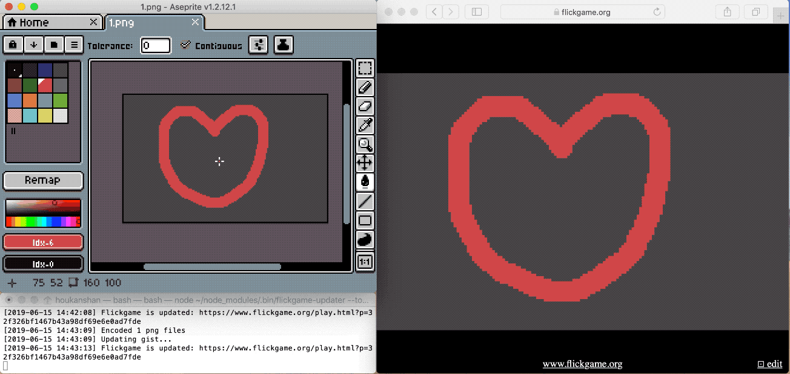
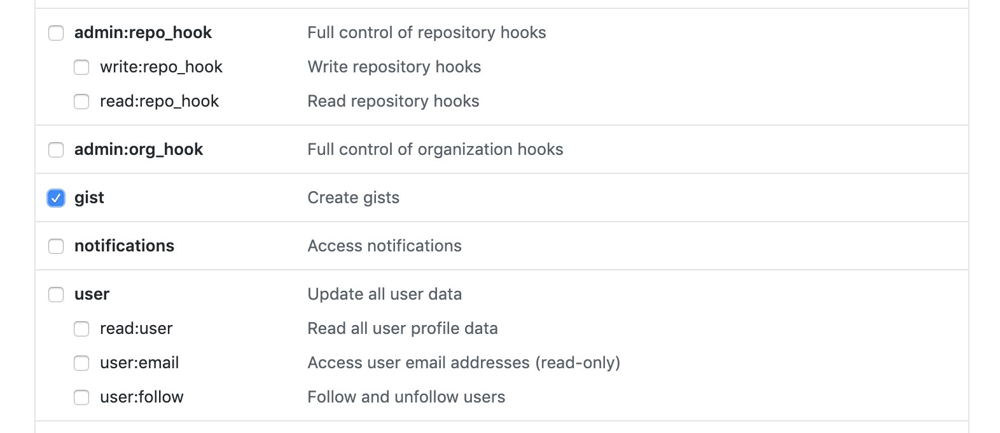

# Flickgame Updater




## Install

1. Install [NodeJS](https://nodejs.org/en/)
2. Install `flickgame-updater` through `npm`
```bash
npm install -g flickgame-updater
```

## Usage

1. Generate a GitHub personal access token: https://github.com/settings/tokens/new
  > 
2. Run `flickgame-updater` as `watch` mode:
```bash
cd <your_png_files_folder>
flickgame-updater --token <github_token> --watch
```
3. Create a 160x100 image in Aseprite or anything you like.
4. Import [palette.ase](https://github.com/houkanshan/flickgame-updater/raw/master/palette.ase) as palette.
5. Save your images as `1.png` `2.png` ... 
6. Still, you have to add hyperlink through the online flickgame editor.
